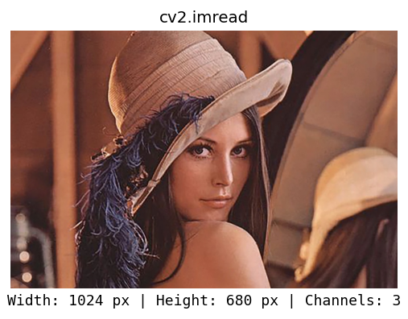
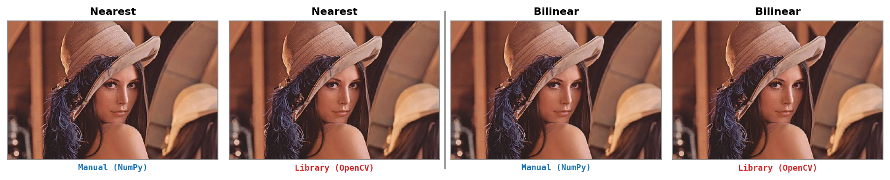
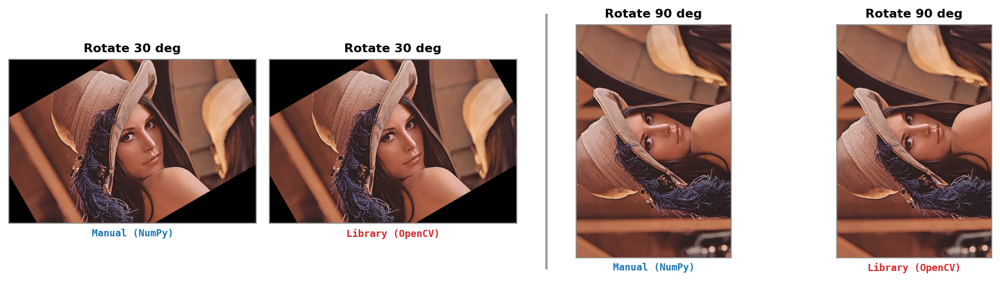
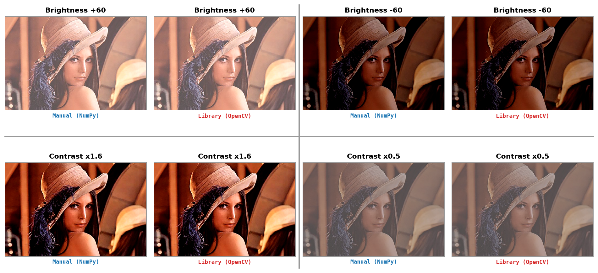
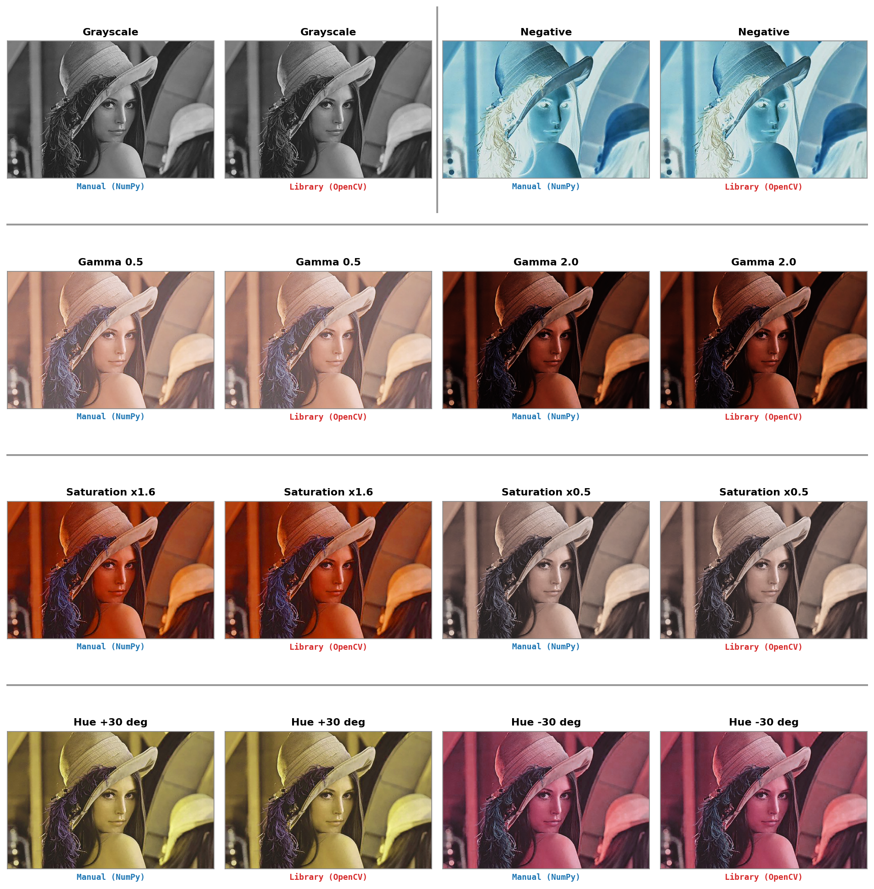

# Advanced Computer Vision — Lab 01

Members: 
- Lưu Thị Yến Nhi (25C11014)
- Hoàng Trọng Vũ (25C15028)

## Introduction
This homework implements core image-processing groups
**from scratch with NumPy** and compares them against OpenCV for quality, time,
and memory:

1. **Read & display** — load an image with `cv2.imread`, store it as a NumPy array, and display/save it with matplotlib.
2. **Scale** — nearest & bilinear resize, arbitrary-angle and 90° rotation vs `cv2.resize` / `cv2.warpAffine`.
3. **Point transforms** — brightness, contrast, grayscale, saturation up/down, hue shift ±, negative, gamma <1/>1 vs OpenCV equivalents.

Manual results are scored against the OpenCV result with **MAE** and **PSNR**,
and each operation reports elapsed time plus approximate memory usage.

Project layout:
```
source/
  README.md         # this file
  main.py            # full runner, feature runners, plotting, and CSV writing
  image_io.py        # Feature 1: read & display
  scale.py           # Feature 2: resize & rotate
  transform.py       # Feature 3: brightness / contrast / color transforms
  utils/             # metrics, benchmarking, and plotting helpers
  images/            # sample image(s)
  results/           # generated comparison figures and benchmark CSV files
  requirements.txt
```

## Setup
Use Python >= 3.12.

```bash
python3 -m venv .venv
source .venv/bin/activate          # Windows: .venv\Scripts\activate
pip install -r requirements.txt
```
Dependencies: `numpy`, `opencv-python`, `matplotlib`.

## Usage
```bash
# Run the full features on the sample image (images/lena.jpg)
python main.py
# Or run on new image
python main.py path/to/image.jpg

# Run one feature group
python main.py --feature io
python main.py --feature scale
python main.py --feature transform
python main.py --feature scale path/to/image.jpg
```

The results:
- Figures are written to `results/`. 
- Benchmark CSV files are also written under `results/`, such as `benchmark_all.csv`, `benchmark_scale.csv`, and `benchmark_transform.csv`. 

**Note.** Each benchmark is measured once per representative operation because repeated variants, such as hue `+30` and `-30`, have similar cost.

## Results

Each comparison figure keeps every operation as a Manual-vs-OpenCV pair, with
colored method labels and separators for report-friendly LaTeX insertion.

**Feature 1 — Read & display** (OpenCV read and matplotlib display):



**Feature 2a — Resize** (nearest, bilinear):



**Feature 2b — Rotate** (30°, 90°):



**Feature 3a — Brightness & contrast**:



**Feature 3b — Color** (grayscale, saturation up/down, hue ±, negative, gamma <1/>1):



After choosing the matching library calls — `cv2.addWeighted` (saturating, like
the manual clip) instead of `convertScaleAbs` (which takes `|αx+β|`), a rounded
gamma LUT, and OpenCV's bit-exact resize variants — every operation agrees with
the library, except arbitrary-angle rotation and HSV-based color adjustments,
which keep small residuals from interpolation and OpenCV's uint8 HSV
quantization. See `../doc/report.tex` for the full analysis.

## Benchmark Summary
Benchmark CSV files store one row for the manual NumPy implementation and one
row for the matching OpenCV implementation. Columns include:
`feature`, `operation`, `implementation`, running time (`time_ms`), memory usage (`peak_kib`),
`mae_vs_opencv`, and `psnr_vs_opencv`.

The table below is copied from `results/benchmark_all.csv` for `lena.jpg`, with
manual and OpenCV rows merged into one row per operation.

| Operation | NumPy time ms | OpenCV time ms | NumPy peak KiB | OpenCV peak KiB | MAE | PSNR dB |
|---|---:|---:|---:|---:|---:|---:|
| resize nearest | 1.721791 | 0.762833 | 362.294922 | 225.873047 | 0.010878 | 56.133817 |
| resize bilinear | 9.585458 | 0.404208 | 20824.558594 | 225.873047 | 0.004745 | 71.368578 |
| rotate 30 (no expand) | 117.704917 | 0.588708 | 193806.064453 | 2040.296875 | 0.138756 | 38.837706 |
| rotate 90 | 0.011875 | 0.606250 | 0.226562 | 2040.250000 | 0.000000 | inf |
| brightness +60 | 1.589333 | 0.536542 | 12241.472656 | 4080.187500 | 0.000000 | inf |
| contrast x1.6 | 10.735709 | 0.546042 | 24480.851562 | 4080.187500 | 0.000000 | inf |
| grayscale | 4.476833 | 0.068250 | 16321.281250 | 680.093750 | 0.000003 | 103.548592 |
| saturation x1.6 | 44.441375 | 3.141875 | 66646.609375 | 12920.914062 | 0.455611 | 50.069759 |
| hue +30 deg | 43.972500 | 1.885375 | 66643.140625 | 4760.681641 | 0.400402 | 51.361964 |
| invert | 5.798667 | 0.166708 | 24480.851562 | 2040.093750 | 0.000000 | inf |
| gamma 0.5 | 7.193083 | 0.230334 | 24480.898438 | 2041.554688 | 0.000000 | inf |

**Note.**
- The manual implementation prioritizes clarity and direct algorithmic steps. The NumPy code is still vectorized, but expressions such as bilinear interpolation, rotation, HSV conversion, and clipping allocate several full-size intermediate arrays.
- OpenCV is faster because its kernels are optimized C/C++ routines that avoid
most temporary arrays, use cache-friendly loops, and may use SIMD or
multithreading.  
- Memory usage (`peak_kib`) is measured with Python so native OpenCV memory can be under-reported.
