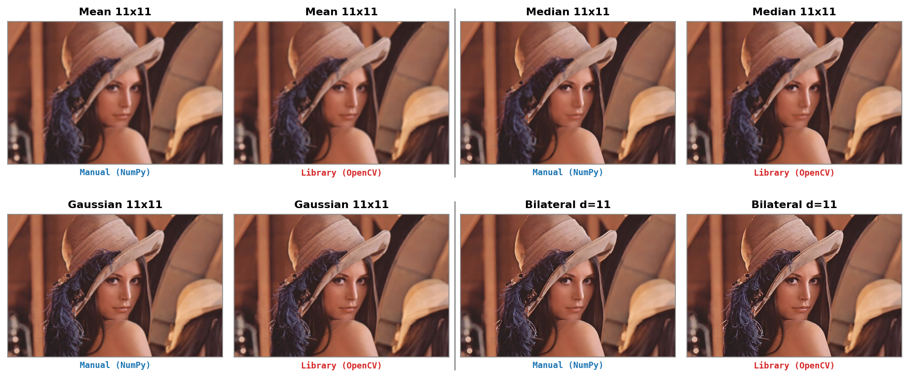
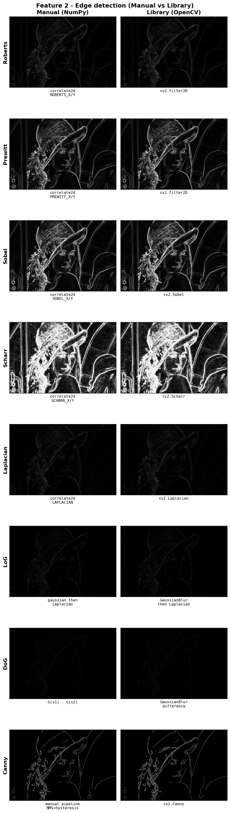

# Smoothing & Edge Detection: Manual vs Library

*Tiếng Việt: [README-vi.md](README-vi.md)*

**Advanced Computer Vision — Lab 02**

| Member | Student ID |
|---|---|
| Lưu Thị Yến Nhi | 25C11014 |
| Hoàng Trọng Vũ | 25C15028 |

## Introduction
This homework implements two image-processing groups **from scratch with NumPy**
and compares each one against OpenCV pixel-for-pixel:

1. **Smoothing** — Mean, Gaussian, Median, Bilateral and Box filters vs
   `cv2.blur` / `cv2.GaussianBlur` / `cv2.medianBlur` / `cv2.bilateralFilter` / `cv2.boxFilter`.
2. **Edge detection** — Roberts, Prewitt, Sobel, Scharr, Laplacian, LoG/DoG and a
   full Canny pipeline vs `cv2.filter2D` / `cv2.Sobel` / `cv2.Scharr` /
   `cv2.Laplacian` / `cv2.Canny`.

Every manual result is scored against the library result with **MAE** and **PSNR**.

Project layout:
```
source/
  smoothing.py        # Feature 1: Mean/Gaussian/Median/Bilateral/Box + shared toolbox
  edge_detection.py   # Feature 2: Roberts/Prewitt/Sobel/Scharr/Laplacian/LoG/DoG/Canny
  images/             # sample image(s)
  results/            # generated comparison figures
  requirements.txt
doc/                  # LaTeX report and figures
README.md             # this file
README-vi.md          # Vietnamese version
```
All code lives in just two files. `smoothing.py` holds the shared primitives
(the manual `correlate2d`, the Gaussian kernel, MAE/PSNR, image I/O and the
comparison-grid plot); `edge_detection.py` imports those from it.

## Setup
```bash
python3 -m venv .venv
source .venv/bin/activate          # Windows: .venv\Scripts\activate
pip install -r source/requirements.txt
```
Dependencies: `numpy`, `opencv-python`, `pillow`, `matplotlib`.

## Usage
```bash
cd source

# Feature 1 — Smoothing  
python smoothing.py
python smoothing.py path/to/img.jpg

# Feature 2 — Edge 
python edge_detection.py
python edge_detection.py path/to/img.jpg
```
Comparison metrics are printed to the console; each script writes one figure to
`source/results/` (and copies it to `doc/figures/` for the report).

## Result
Each figure is a grid: **columns are the method (Manual vs Library)** and
**rows are the operations**, so the two implementations sit side by side.

**Feature 1 — Smoothing** (Mean, Gaussian, Median, Bilateral, Box):


**Feature 2 — Edge detection** (Roberts, Prewitt, Sobel, Scharr, Laplacian, LoG, DoG, Canny):


### Quantitative agreement (sample `lena.jpg`)
| Feature | MAE | PSNR (dB) | Note |
|---|---|---|---|
| Mean 5×5 | 0.000 | ∞ | identical box kernel |
| Gaussian 5×5, σ=1 | 0.006 | 70.61 | matches `cv2.getGaussianKernel` |
| Median 5×5 | 0.000 | ∞ | exact (median picks a real sample) |
| Bilateral d=5 | 0.932 | 43.05 | OpenCV uses internal LUT approximations |
| Box 5×5 | 0.000 | ∞ | identical to mean |
| Roberts | 0.000 | ∞ | identical 2×2 kernels |
| Prewitt | 0.000 | ∞ | identical 3×3 kernels |
| Sobel | 0.000 | ∞ | identical (vs `cv2.Sobel`) |
| Scharr | 0.000 | ∞ | identical (vs `cv2.Scharr`) |
| Laplacian | 0.000 | ∞ | identical (`ksize=1` kernel) |
| LoG | 0.000 | ∞ | Gaussian + Laplacian, both linear |
| DoG | 0.000 | ∞ | difference of two Gaussian blurs |
| Canny | 1.222 | 23.19 | 99.52% of pixels share the same edge label |

Once each manual operation is paired with the **matching** library call — the same
kernels and `BORDER_REFLECT_101` padding to mirror `cv2.filter2D` — every **linear**
operator agrees **exactly** (MAE = 0): mean, median, box, Roberts, Prewitt, Sobel,
Scharr, Laplacian, LoG and DoG. Gaussian leaves only ≈0.006 MAE from float rounding.
The two structurally different cases are the **bilateral filter** (OpenCV uses
quantized look-up tables internally, ≈0.93 MAE) and **Canny** (non-linear NMS +
hysteresis, yet 99.5% edge-label agreement). See `doc/report.tex` for the full
analysis.

## Contribution
| Work item | Lưu Thị Yến Nhi (25C11014) | Hoàng Trọng Vũ (25C15028) |
|---|---|---|
| Feature 1 — Smoothing (Mean/Gaussian/Median/Bilateral/Box) | 60% | 40% |
| Feature 2 — Gradient operators (Roberts/Prewitt/Sobel/Scharr) | 40% | 60% |
| Feature 2 — Laplacian, LoG/DoG, Canny pipeline | 50% | 50% |
| Testing & manual-vs-library comparison | 40% | 60% |
| Report writing & figures | 60% | 40% |
| **Overall effort** | **50%** | **50%** |
