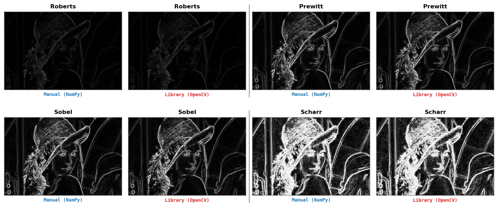
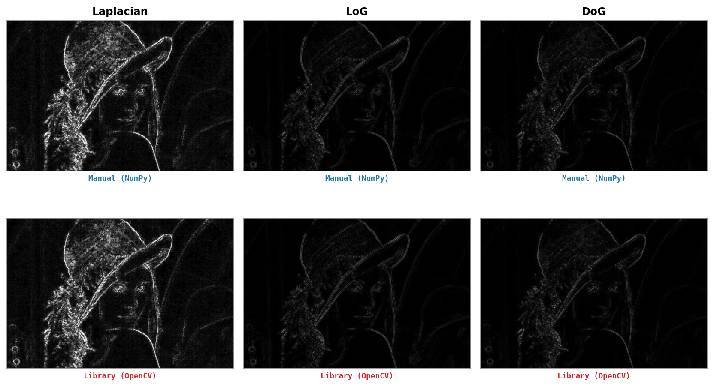
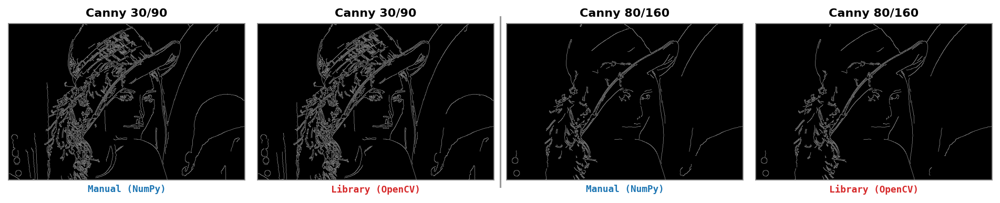

# Advanced Computer Vision — Lab 02

Members:
- Lưu Thị Yến Nhi (25C11014)
- Hoàng Trọng Vũ (25C15028)

## Introduction
This homework implements smoothing and edge-detection algorithms
**from scratch with NumPy** and compares them against OpenCV for quality, time,
and memory:

1. **Smoothing** — Mean, Gaussian, Median, and Bilateral filters vs
   `cv2.blur`, `cv2.GaussianBlur`, `cv2.medianBlur`, and `cv2.bilateralFilter`.
2. **Edge detection** — Roberts, Prewitt, Sobel, Scharr, Laplacian, LoG, DoG,
   and Canny vs `cv2.filter2D`, `cv2.Sobel`, `cv2.Scharr`, `cv2.Laplacian`, and
   `cv2.Canny`.

Manual results are scored against the OpenCV result with **MAE** and **PSNR**.
For Canny, the benchmark also reports the percentage of pixels with the same
edge/non-edge label. Each operation reports elapsed time plus approximate memory
usage.

Project layout:
```
source/
  README.md          # this file
  main.py            # full runner, feature runners, plotting, and CSV writing
  smoothing.py       # Feature 1: Mean/Gaussian/Median/Bilateral
  edge_detection.py  # Feature 2: Roberts/Prewitt/Sobel/Scharr/Laplacian/LoG/DoG/Canny
  ops/               # correlation, convolution, padding, stride, and border handling
  utils/             # image I/O, metrics, benchmarking, and plotting helpers
  images/            # sample image(s)
  results/           # generated comparison figures and benchmark CSV files
  requirements.txt
```

## Setup
Use Python >= 3.12.

```bash
python3 -m venv .venv
source .venv/bin/activate          # Windows: .venv\Scripts\activate
pip install -r requirements.txt
```

Dependencies: `numpy`, `opencv-python`, `pillow`, `matplotlib`.

## Usage
```bash
# Run all features on the sample image (images/lena.jpg)
python main.py

# Or run on a new image
python main.py path/to/image.jpg

# Run one feature group
python main.py --feature smoothing
python main.py --feature edge
python main.py --feature edge path/to/image.jpg
```

The results:
- Figures are written to `results/` and copied to `../doc/figures/`.
- Benchmark CSV files are written under `results/`, including
  `benchmark_all.csv`, `benchmark_smoothing.csv`, and
  `benchmark_edge_detection.csv`.

## Results

Each comparison figure keeps every operation as a Manual-vs-OpenCV pair, with
colored method labels and separators for report-friendly LaTeX insertion.

**Feature 1 — Smoothing** (Mean, Median, Gaussian, Bilateral):


**Feature 2a — Gradient edge detection** (Roberts, Prewitt, Sobel, Scharr):



**Feature 2b — Second-order response maps** (Laplacian, LoG, DoG):



**Feature 2c — Canny** (two threshold sets):



The linear correlation-based operators match OpenCV exactly when the kernel,
padding, and normalization are aligned. Gaussian differs only by small floating
point rounding. Bilateral and Canny have larger residual differences because
they include non-linear per-pixel decisions and OpenCV uses optimized internal
implementations. See `../doc/report.tex` for the full analysis.

## Benchmark Summary
Benchmark CSV files store one row for the manual NumPy implementation and one
row for the matching OpenCV implementation. Columns include:
`feature`, `operation`, `implementation`, running time (`time_ms`), memory usage
(`peak_kib`), `mae_vs_opencv`, `psnr_vs_opencv`, and
`edge_agreement_percent`.

The table below is copied from `results/benchmark_all.csv` for `lena.jpg`, with
manual and OpenCV rows merged into one row per operation.

| Operation | NumPy time ms | OpenCV time ms | NumPy peak KiB | OpenCV peak KiB | MAE | PSNR dB | Edge agreement % |
|---|---:|---:|---:|---:|---:|---:|---:|
| mean 11x11 | 114.445750 | 2.714125 | 65734.193359 | 2040.093750 | 0.000000 | inf |  |
| median 11x11 | 1819.165750 | 43.057416 | 512174.691406 | 2040.093750 | 0.000000 | inf |  |
| gaussian 11x11 sigma=2 | 101.043083 | 6.973500 | 65733.289062 | 2040.093750 | 0.010020 | 68.121998 |  |
| bilateral d=11 | 1409.568250 | 4.312833 | 130964.289062 | 2040.093750 | 1.178549 | 40.826327 |  |
| roberts | 7.245833 | 5.791667 | 27279.648438 | 27200.468750 | 0.000000 | inf |  |
| prewitt | 12.355208 | 4.589000 | 27293.046875 | 27200.468750 | 0.000000 | inf |  |
| sobel | 10.736125 | 5.829459 | 27293.015625 | 27201.046875 | 0.000000 | inf |  |
| scharr | 11.222166 | 4.901667 | 27293.015625 | 27201.046875 | 0.000000 | inf |  |
| laplacian response | 7.398875 | 3.879041 | 27201.210938 | 27201.046875 | 0.000000 | inf |  |
| LoG response 11x11 sigma=2 | 68.060708 | 5.152708 | 27293.046875 | 27201.046875 | 0.000000 | inf |  |
| DoG response | 30.716583 | 4.791834 | 27320.054688 | 27201.046875 | 0.000000 | inf |  |
| canny low=30 high=90 | 128.306500 | 2.474416 | 42256.250000 | 1360.187500 | 1.418335 | 22.547614 | 99.443790 |
| canny low=80 high=160 | 139.190041 | 1.069417 | 42255.281250 | 1360.187500 | 0.279419 | 29.602843 | 99.890424 |

**Note.**
- The manual implementation prioritizes clarity and direct algorithmic steps.
  The correlation operator uses NumPy slicing to avoid explicit pixel loops, but
  repeated windows and intermediate arrays still cost time and memory.
- OpenCV is faster because its kernels are optimized C/C++ routines that use
  cache-friendly loops, SIMD, and sometimes multithreading.
- Memory usage (`peak_kib`) is measured with Python, so native OpenCV memory can
  be under-reported.
